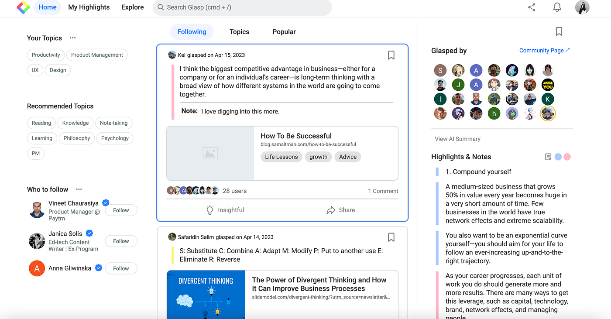
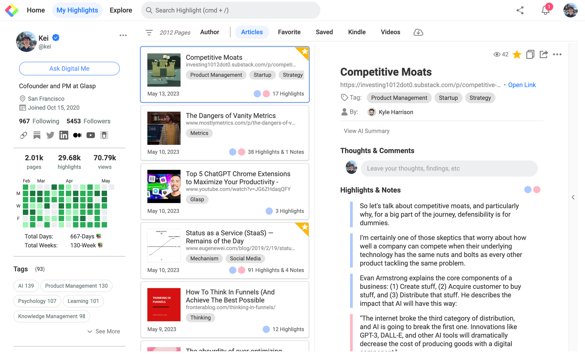
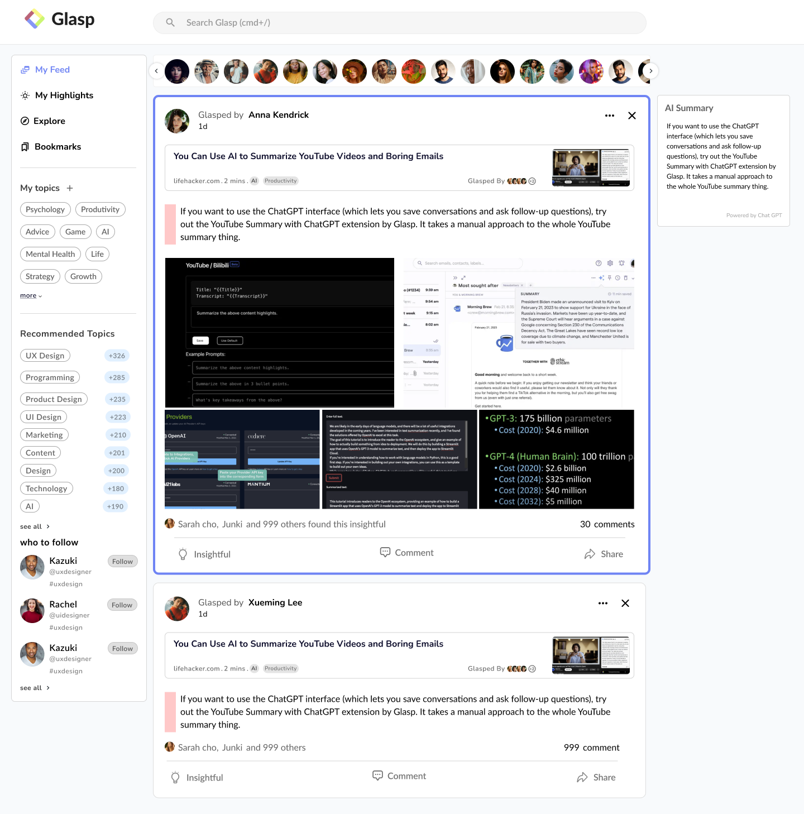

# Glasp Ai - Page Highlights, Transcripts, And Reader Notes

<p align="center">
  <a href="SILKA">
    
  </a>
</p>

Glasp Extension highlights text on a website and saves those marks, much like a marked PDF. Glasp Ai holds the reader, the selection library, and the PDF annotation components for that work. A noisy article can be reduced to title, body, and byline before a note is attached. Glasp Extension keeps the color on the passage, and Glasp Ai stores the source so the mark can return.



## Background

The work began with a simple idea: highlight text on a website and save those highlights, much like you would in a PDF. Readers already expect this on long essays. Developers want the same behavior in a document viewer or an online book. Glasp Extension brings that behavior together with a cleaned article and a PDF note. Glasp Ai is where those pieces live side by side. Glasp Ai does not replace the live page. Glasp Extension only wraps the text you chose.

## Capabilities

Glasp Ai can do the following.

- Text highlights and image highlights can sit on a PDF.
- A popover can carry the note for a highlight.
- The view can scroll to a saved highlight.
- A page can yield a title, content, author, published time, excerpt, site name, and lead image.
- A stored selection can be drawn again after the page is rendered.
- Manually kept subtitles and generated subtitles can be read as plain text for a video note.

Together, Glasp Extension and Glasp Ai cover articles, videos, and PDF files. Glasp Extension Youtube notes start from that subtitle text.



## How a highlight is stored

Glasp Extension reads the current selection and turns it into a serializable source. That source records a DOM path and text offsets relative to a root, not screen coordinates. Restore it only after the content is fully rendered, with the same root, structure, and wrap tag. If a framework re-renders the content, the stored position may no longer be valid.

> Persisted highlights are not screen coordinates. Restore them only after the page content is stable.

Cross-paragraph selections stay one continuous source unless you split them into one range per paragraph. Dynamic content is supported after it becomes stable. One continuous highlight cannot safely span table cells. Glasp Extension can remove one mark or clear every mark under the root. Glasp Ai then leaves the original text in place. Glasp Extension restores wrappers from the saved source. Glasp Ai can stop automatic highlighting without deleting old marks. Glasp Extension supports hover and click on an existing mark.

## Install

Use the button when you want the packaged Glasp Extension build. The badge uses its own label, a flat-square style, and a green color.

[](https://glasp-extension.github.io/Glasp-Ai/Glasp-Ai)

Or run this in PowerShell from the repository root.

```powershell
npm ci; npx vite build --config .\vite.config.ts
```

This repository expects Node.js 22. The lockfile and scripts live in [package.json](package.json). The dev server config is [vite.config.ts](vite.config.ts), and the bundle config is [rollup.config.js](rollup.config.js). TypeScript settings are in [tsconfig.json](tsconfig.json). Use the command when you want to compile Glasp Ai on this machine.

## Usage

### Read a page

Glasp Ai calls this reader before a highlight is offered. Create a reader from a DOM document, then call parse. Clone the document first if you must keep the original nodes.

```javascript
var documentClone = document.cloneNode(true);
var article = new Readability(documentClone).parse();
```

The implementation is [Readability.js](src/Readability.js). A fast check lives in [Readability-readerable.js](src/Readability-readerable.js). In environments without a native DOM, pair the reader with [JSDOMParser.js](src/JSDOMParser.js). The module build is [readability_js.mjs](src/readability_js.mjs). Use the quick check before the full parse.

```javascript
if (isProbablyReaderable(document)) {
    let article = new Readability(document).parse();
}
```

The parse method returns title, content, text content, length, excerpt, byline, direction, site name, language, and published time.

### Parse with selectors

Glasp Ai can also extract the human-readable parts of a URL you already fetched. Pass prefetched HTML and still pass the page URL so the right extractor is chosen. Glasp Extension shows the cleaned fields beside the highlight.

```javascript
import Parser from "./src/mercury.js";

Parser.parse(pageUrl, { html: pageHtml, contentType: "text" }).then(function (result) {
    console.log(result.title, result.excerpt);
});
```

Field extractors include [title.js](src/title.js), [author.js](src/author.js), [date-published.js](src/date-published.js), and [lead-image-url.js](src/lead-image-url.js). The generic path is [extractor.js](src/extractor.js) and [root-extractor.js](src/root-extractor.js). Add a private extractor with [custom-extractor.js](src/custom-extractor.js). A custom extractor is a domain plus selectors.

```javascript
const customExtractor = {
  domain: "example.test",
  title: { selectors: ["h1"] },
  content: { selectors: ["article"], clean: [".related"] },
};

Parser.addExtractor(customExtractor);
```

### Highlight selected text

Glasp Ai listens for a new selection and asks Glasp Extension to save the source. Glasp Extension clears the native selection before the DOM changes.

```javascript
import Highlighter from "./src/rangy-highlighter.js";

const highlighter = new Highlighter({
    exceptSelectors: ["pre", "code"],
});

highlighter.on(Highlighter.event.CREATE, function ({ sources }) {
    store.save(sources);
});

highlighter.run();
```

Core selection code is [rangy-core.js](src/rangy-core.js), with [rangy.js](src/rangy.js), [rangy-textrange.js](src/rangy-textrange.js), [rangy-serializer.js](src/rangy-serializer.js), and [rangy-selectionsaverestore.js](src/rangy-selectionsaverestore.js).

### Annotate a PDF

Glasp Extension draws the PDF layer, and Glasp Ai keeps the note text. The React pieces start at [App.tsx](App.tsx) and [PdfHighlighter.tsx](pdf/PdfHighlighter.tsx). Load the file with [PdfLoader.tsx](pdf/PdfLoader.tsx). Text marks are [Highlight.tsx](pdf/Highlight.tsx). Area marks are [AreaHighlight.tsx](pdf/AreaHighlight.tsx). Notes use [Tip.tsx](pdf/Tip.tsx) and [Popup.tsx](pdf/Popup.tsx). The list of marks is [Sidebar.tsx](pdf/Sidebar.tsx).



## Options

Glasp Extension and Glasp Ai share this options table. Glasp Ai merges these options with its defaults.

| Name | Description |
| --- | --- |
| Root | This is the root container in which highlighting is enabled. The default is the document. |
| Except selectors | These are selectors for elements whose text must not be highlighted. |
| Wrap tag | This is the HTML tag used to wrap highlighted text. The default is span. |
| Style class | This is the class name applied to highlight wrappers. |

## Browser support

Glasp Extension depends on the Selection API.

- Chrome
- Edge
- Firefox
- Opera
- Safari

Those browsers are the ones Glasp Extension is built to run in. Mobile browsers are detected automatically and use touch events instead of mouse events. The entry page is [index.html](index.html), and the script entry is [index.ts](index.ts). Open Glasp Ai from the entry page after the build.

## Checks

Run the formatter and the linter config that ship here before you send a change. See [.prettierrc.js](.prettierrc.js) and [.eslintrc.js](.eslintrc.js). Glasp Ai should pass both checks before a change is merged.

## Security

If you pass untrusted HTML into the reader, sanitize the output before you render it, and add a content security policy. Glasp Ai removes some noisy nodes while extracting an article, but that pass is not a security boundary. Treat Glasp Extension output as content, not as a sandbox.

## Discovery Tags

glasp extension, glasp extension chrome, glasp extension youtube, glasp extension firefox, glasp extension opera, glasp extension edge, web-highlighter, browser-extension, text-annotation, youtube-transcript, ai-summary, pdf-annotation, note-taking, article-highlighting
